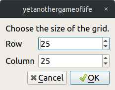
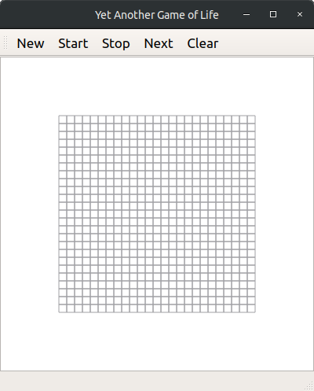
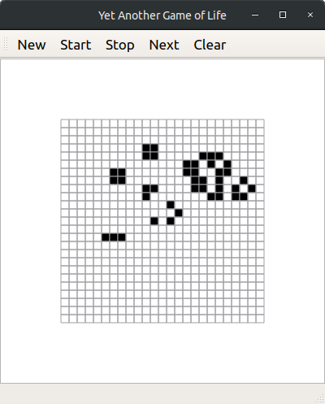

# Yet Another Game of Life
Yet Another Game of Life is an implementation of the Conway's [Game of Life](https://en.wikipedia.org/wiki/Conway%27s_Game_of_Life) using Qt.

## Motivation
This project exists as a learning support for Qt Framework.
Among the many examples the Qt documentation provides, there is already an implementation of the Game of Life that use Model-View design.
For the sake of learning, I purposely did my own implementation trying to stay away from what has already been done.

## Desing
When exploring the Qt documentation, it is stated that the Graphics are designed to be able to display many items.
I wanted the game to be able to create "large" game space. So I design the game core around the [GraphicsItem](https://doc.qt.io/qt-5/qgraphicsitem.html) class : Cell.
A Cell owns its current and previous state as a boolean. It knows how to draw itself whether it is alive or dead.
All the cells are owned by a [QGraphicsView](https://doc.qt.io/qt-5/qgraphicsview.html) class : GameView.
The View's role is to create the cells for the game, display all of them and update the states of the whole grid when called.
The View is owned by the [QMainWindow](https://doc.qt.io/qt-5/qmainwindow.html) class : MainWindow. This class owns the GameView and a [Toolbar](https://doc.qt.io/qt-5.9/qtoolbar.html) gathering the controls for the game.
Toolbar action buttons control the state of the game.
The code was written in Qtcreator on Ubuntu 18.04.

## Dependencies
  * Qt5
  * qmake

## Build
```bash
$ cd YetAnotherGameofLife
$ mkdir build
$ cd build
$ qmake ../YetAnotherGameofLife.pro
$ make
```

## Usage
```bash
$ ./yetanothergameoflife
```

### Start Dialog
Upon starting: the game asks you to give the size of the desired grid. The game allows you to create a game of minimum 2x2 to maximum 1000x1000.
Note that the later creates 1 000 000 cells and results in a fairly poor experience (on a Lenevo Thinkpad T420, i5-2520M, 4GB).



### Mainwindow
The main window of the game is composed of a menu toolbar and a game view.


### Action Menu Bar
The menu toolbar provides the following actions:
  * **New** : Calls the dialog to create a new grid.
  * **Start** : Start a loop updating the grid every 100ms.
  * **Stop** : Stops the aforementioned loop.
  * **Next** : Update the grid according to the rules. If the loop is on then stops it.
  * **Clear** : Kills all the cells in the grid. If the loop is on then stops it.

### Game View
The grid can be explored by scrolling in and out. Each cell of the grid can be toggled on&off using the mouse.


## TO-DO
  * Separate the game model to its view (this is a big change I realised too late to make).
  * Make the View.update() loop async to speed it up.
  * Take advantage of the optimisation options of QGraphicsView.
  * Add tests
  * Add periodic boundary condition.
  * Add different neighborhood scanning kernels.
  * Use QMessageLogger instead of std::clog.

## Notes
Comments were written in the java-doc style, so in practice we can generate a documentation as good as the comments...
Note for myself: I was surprised by the use of raw pointers everywhere, turns out all classes
that descend from QObject have memory handling so, nothing to worry on that side.

## License
[GNU GPLv3](https://www.gnu.org/licenses/gpl-3.0.html)

